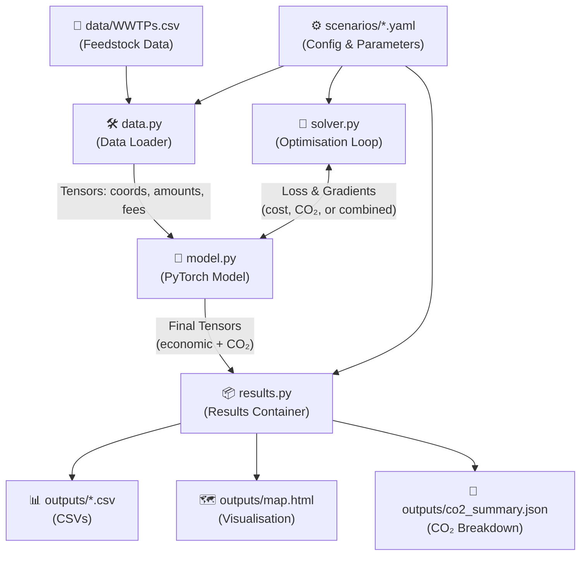

# Data Pipeline & Flow

This document maps out exactly how data moves through the HTL Plant Optimiser—from raw inputs to final outputs.

---

## 1. High-Level Data Flow

---

## 2. Required Input Data

### The Feedstock CSV
You must provide a CSV file containing your distributed feedstock sources. By default, the script looks for `data/WWTPs.csv`. 

**Required Columns:**
| Column | Type | Purpose |
|---|---|---|
| `latitude` | Float | Geographic latitude in decimal degrees. |
| `longitude` | Float | Geographic longitude in decimal degrees. |
| `scale` | Float | Feedstock availability (e.g., MMGal/day). |

**Optional Columns:**
| Column | Type | Purpose |
|---|---|---|
| `tipping_fee` | Float | Per-source tipping fee. *Only required if `economics.tipping_fee.mode` is set to `from_column` in your YAML scenario.* |

*(Note: You can change the expected column names in the scenario YAML if your data uses different headers).*

### The Scenario YAML
The YAML file acts as the configuration hub and defines all economic, structural, and solver parameters. It is the single source of truth for a run. The file is structured into five distinct sections:

**1. `data` (Data Pointers)**
Tells the model where to find the CSV and what the columns are named.
- `feedstock_file`: Path to the CSV (e.g., `data/WWTPs.csv`)
- `lat_column`, `lon_column`, `scale_column`: Names of the required CSV columns.
- `convertible_fraction`: Multiplier to scale the raw feedstock before processing.

**2. `model` (Physical Layout)**
Defines the scale and starting point of the optimisation.
- `num_candidate_plants`: The number of `m` candidate plants to place. 
- `initialization`: Strategy for initial placement (e.g., `top_feedstock`).

**3. `economics` (Cost & Revenue Functions)**
Contains all parameters for the cost objective function.
- `transport_cost_per_unit_km`: The transport rate (multiplier for distance $\times$ volume).
- `tipping_fee`: Configuration for tipping fees (can be fixed, random range, or read from a CSV column).
- `capital_cost_coef` / `capital_cost_exponent`: Power law parameters for capital expenditure.
- `revenue_coef` / `revenue_exponent`: Power law parameters for revenue generation.
- `orphan_penalty`: The flat cost per unit of feedstock left unprocessed.

**4. `emissions` (CO₂ Tracking — optional)**
Parallel CO₂ mass-balance parameters. Disabled by default (`enabled: false`).
- `enabled` / `mode`: Master switch and analysis mode (`post_hoc`, `co2_first`, `combined`).
- `co2_transport_per_unit_km`: kg CO₂ per feedstock-unit per km transported.
- `co2_orphan_per_unit`: kg CO₂ per feedstock-unit left unprocessed.
- `co2_processing_per_unit`: kg CO₂ per feedstock-unit processed.
- `co2_fuel_displacement_credit`: kg CO₂ avoided per feedstock-unit (negative = credit).
- `co2_capital_per_unit` / `co2_capital_exponent`: Embodied carbon scaling (optional).
- `co2_cost_weight`: Social cost of carbon ($/kg CO₂), used only in `combined` mode.

**5. `solver` (Optimiser Tuning)**
Controls the gradient descent behaviour (PyTorch Adam optimiser).
- `num_epochs`, `learning_rate`, `convergence_tol`: Standard training parameters.
- `scheduler_enabled`: Boolean to toggle learning rate reduction on plateau.

**6. `constraints` (Lagrangian Penalties)**
An optional list of constraints that penalise the solver for violating real-world conditions (but don't affect true economic cost).
- `type`: E.g., `plant_profitability`, `max_orphan_fraction`.
- `params`: Constraint-specific variables (e.g., `min_npv: 0`).
- `schedule_type`: Ramp function (e.g., `log`, `linear`) to gradually apply the constraint.

*(See `docs/guide.md` for a complete copy-pasteable YAML template).*

---

## 3. Internal Tensors & Variables

Once the data is loaded into the PyTorch backend, it is transformed into the following key tensors:

| Tensor | Shape | Source / Meaning |
|---|---|---|
| `feed_coords` | `(n, 2)` | Static: Lat/lon of the `n` feedstock sources. |
| `feed_amounts` | `(n,)` | Static: Available scale/capacity of the `n` sources. |
| `tipping_fees` | `(n,)` | Static: Generated based on config or read from CSV. |
| `plant_coords` | `(m, 2)` | **Variable**: Lat/lon of the `m` candidate plants being optimised. |
| `assignment_logits`| `(n, m+1)` | **Variable**: Raw routing weights. The softmax of this dictates what fraction of source `i` goes to plant `j` (or gets orphaned at index `m`). |
| `distances` | `(n, m)` | Dynamic: Haversine distance matrix between all sources and plants. |
| `co2_transport` | scalar | CO₂ from transport (when emissions enabled). |
| `co2_orphan` | scalar | CO₂ from orphaned feedstock (when emissions enabled). |
| `co2_processing` | scalar | CO₂ from HTL processing (when emissions enabled). |
| `co2_fuel_credit` | scalar | Avoided CO₂ from fuel displacement (when emissions enabled). |
| `co2_capital` | scalar | Embodied carbon from plant construction (when emissions enabled). |
| `co2_total` | scalar | Net system-wide CO₂ (when emissions enabled). |
| `plant_co2_total` | `(m,)` | Per-plant net CO₂ (when emissions enabled). |

---

## 4. Final Output Variables

When the optimiser converges, the internal tensors are parsed back into human-readable formats.

**Per-Plant Outputs (`plants.csv`):**
- `plant_id`: Unique identifier (0 to m-1).
- `latitude` / `longitude`: Optimised location.
- `load`: Total feedstock assigned to this plant.
- `delivery_cost`: Total transport + tipping fees incurred by this plant.
- `capital_cost`: Calculated capital cost based on load.
- `revenue`: Calculated revenue based on load.
- `npv`: Net Present Value (Revenue - Delivery - Capital).
- `active`: Boolean (True if at least one source was routed here).
- `co2_transport`: Per-plant transport CO₂ (when emissions enabled).
- `co2_processing`: Per-plant processing CO₂ (when emissions enabled).
- `co2_fuel_credit`: Per-plant fuel displacement credit (when emissions enabled).
- `co2_capital`: Per-plant embodied carbon (when emissions enabled).
- `co2_total`: Per-plant net CO₂ (when emissions enabled).

**Per-Source Outputs (`assignments.csv`):**
- `source_id`: Row index from the input CSV.
- `latitude` / `longitude`: Source location.
- `feed_amount`: Original feedstock scale.
- `assigned_to`: Which plant ID it was predominantly assigned to.
- `is_orphaned`: Boolean (True if the solver chose to leave this feed unassigned due to high transport costs).
- `delivered`: The absolute amount of feed successfully routed to the assigned plant.
- `co2_transport`: Per-source transport CO₂ to assigned plant (when emissions enabled).

**CO₂ Summary (`co2_summary.json`, when emissions enabled):**
- `emissions_mode`: Which mode was used.
- `co2_unit`: "kg CO₂".
- `co2_transport`, `co2_orphan`, `co2_processing`, `co2_fuel_credit`, `co2_capital`, `co2_total`: System-wide CO₂ breakdown.
- `co2_per_unit_delivered`: CO₂ intensity metric.
- `parameters`: Copy of the emissions config parameters used.
